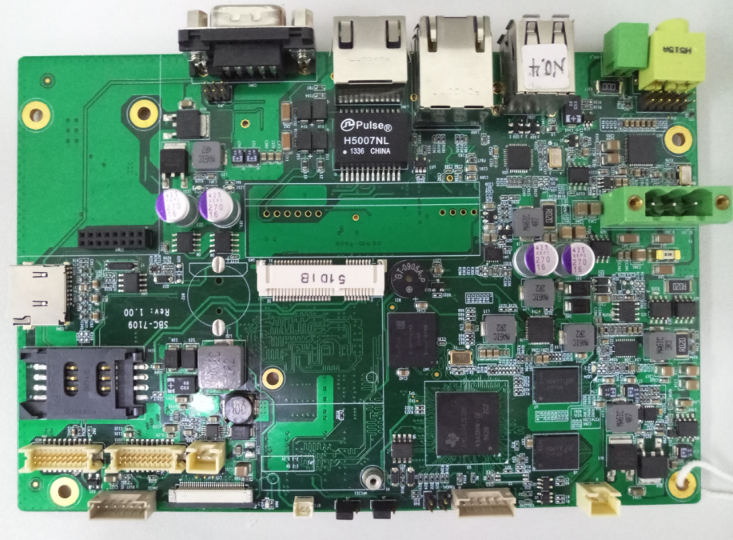
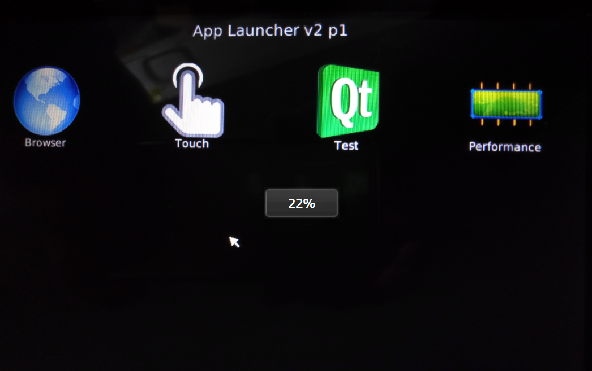

# SBC-7109S-Linux4.4.12-Qt4.8.5 Quick Start Guide

## Illustration

If you do not have a Print Circuit board or a corresponding development BSP package, please contact our business people, they will provide you with the relevant hardware, software resources.

## Hardware features

* 9-24V power input
* Two USB 2.0 Type A Host ports
* Two 10/100M RJ45 LAN ports
* One software selectable RS232/RS485/RS422 serial port by DB9 connector
* One microSD (TF) card socket
* One LVDS LCD interface
* One RGB TTL LCD interface
* One Audio codec with Line in, Line out and Microphone in

## Application of desktop

* Browser：Web Browser；
* Touch：Resistive touch calibration
* Test：For peripheral test
* Performance：Performance test
* If boot frome SD CARD, the desktop will add one BurnSystem application for burn system image into eMMC

## Program the software image

**The following operations are based on the directory from our BSP package for the operation, the PC operating system environment is Ubuntu12.04 x64**

### Step by step to program the soaftware image

* Create SD boot
  * Copy the 'Linux-devkit/tools/mksd.sh' file in the BSP package into your Ubuntu system.
  * Insert your SD card and run above script under normal user, with an SD card block device node, such as /dev/sdb
  * Proceed as follows:
    * ./mksd.sh /dev/sdb
    * Enter your root password
    * Wait for all operations to complete, suggesting: make sd card partition over ...
  * Unplug the SD card and insert it again, waiting for the system to detect the SD card's two partitions.
  * Copy all files in the board-support/prebuilt-images folder into the SD card boot partition.
  * Unzip the rootfs.tar in the filesystem folder into the rootfs partition of the SD card.
    * And at the end run the following two commands:
    * Use `sync` to synchronous data.
    * Use `sudo umount /media/*` to unmount SD card in `ubuntu 12.04`.
    * Use `sudo umount /media/$(whoami)/*` to unmount the SD card in `Ubuntu 14.04` and later version.
    * Pull out the SD card;

* Boot system by SD card then download image into eMMC
  * Insert the SD card was created by above steps, power on the system
  * Click on BurnSystem application, then click Start buttom
  * Waiting the screen show：Burn the new system over... , then turn off power, unplug SD card
  * Power on again to boot the system by eMMC

## Copyright

All of the above interpretation is belong to [Aplex](http://www.aplextec.com/cn/home.php).
