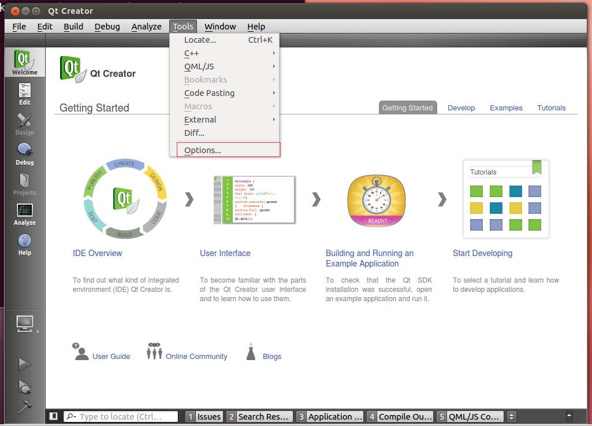
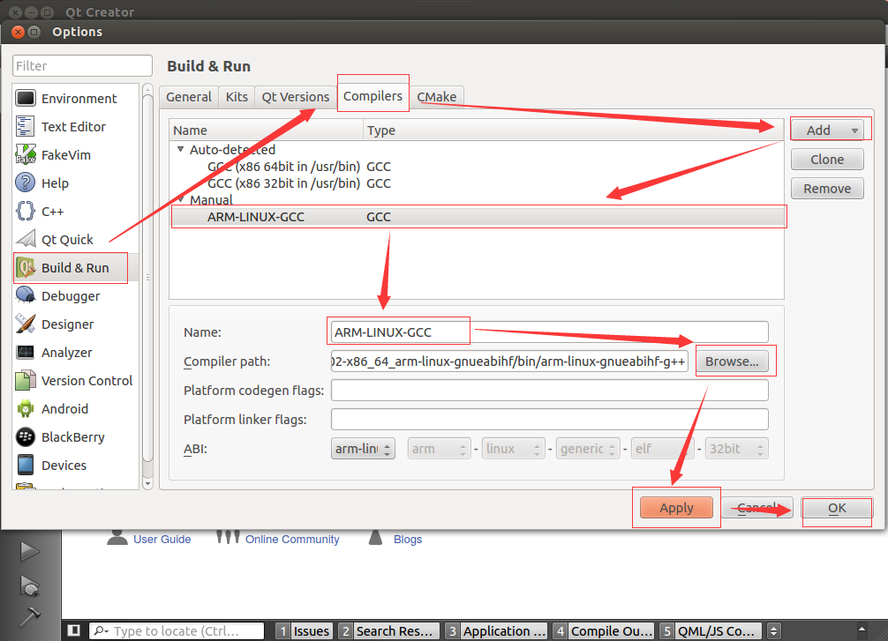
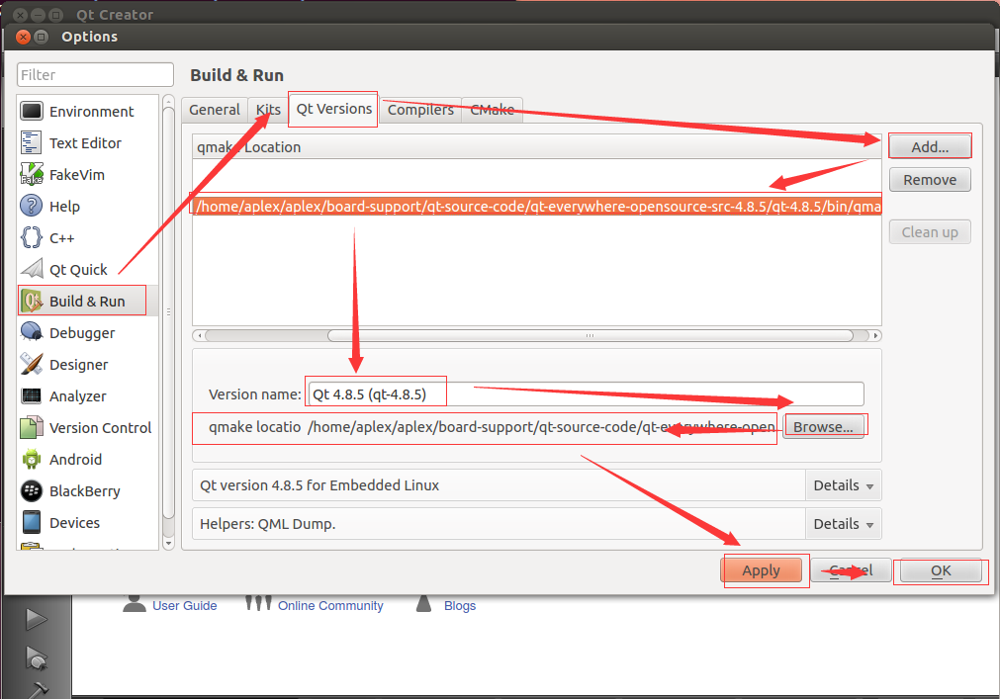
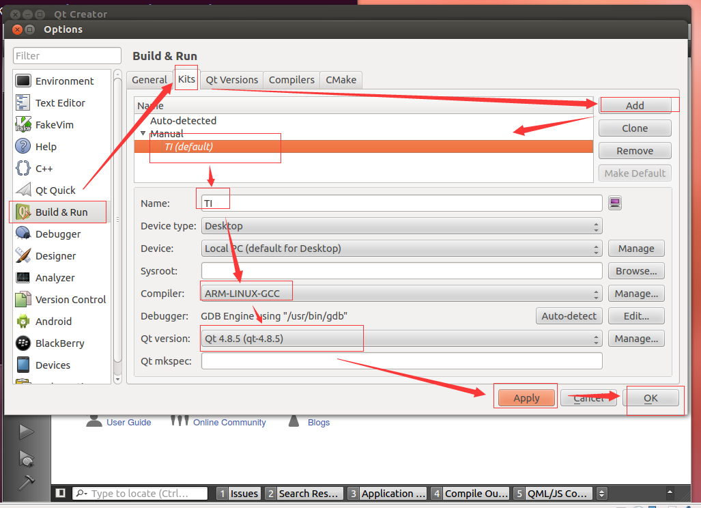
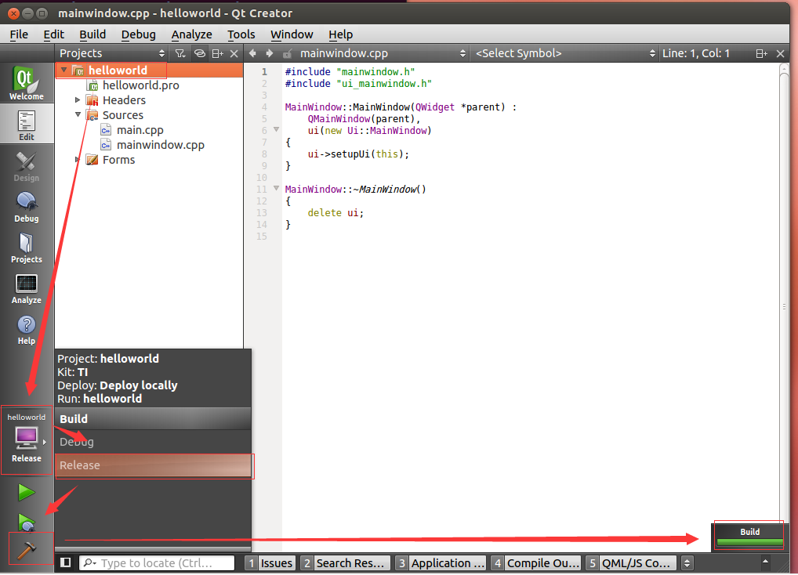

# SBC-7109S-Linux4.4.12-Qt4.8.5 User's Guide

## Illustration

* Before you read this article, make sure you have read ["SBC-7109S-Linux4.4.12-Qt4.8.5 Quick Start Guide"](Quick_Start_Guide.md)
* If you do not have a Print Circuit board or a corresponding development BSP package, please contact our business people, they will provide you with the relevant hardware, software resources.
* The virtual machine operations involved in this article are operated on the following conditions:
  * Ubuntu 12.04 x64 virtual machine built with VMware
  * Account name: aplex
  * Password: aplex
  * The following commands are executed in the VMware Ubuntu 12.04 virtual machine
* As a reader of this document, we will assume that you already have the following skills:
  * Familiar with and master the Linux shell command;
  * Familiar with the Linux ARM cross compiler development process;
  * Familiar with Qt Creator;

## Setup development environment 

* Using VMware to install: ** Ubuntu 12.04 64-bit system **.
If you do not have an Ubuntu 12.04 image, use the `board-support / VMware-Workstation / ubuntu-12.04-desktop-amd64.iso` image in the BSP package.
* Install the package, if there is an error, please execute `sudo apt-get update` to continue:
```shell
    sudo apt-get update
    sudo apt-get install vim
    sudo apt-get install rpm 
    sudo apt-get install m4 
    sudo apt-get install bison 
    sudo apt-get install patch 
    sudo apt-get install build-essential 
    sudo apt-get install zlib1g 
    sudo apt-get install zlib1g-dev 
    sudo apt-get install ncurses-dev 
    sudo apt-get install texinfo 
    sudo apt-get install liblzo2-dev 
    sudo apt-get install uuid-dev 
    sudo apt-get install gettext 
    sudo apt-get install libglib2.0-dev
    sudo apt-get install tree
    sudo apt-get install appmenu-gtk:i386
    sudo apt-get install ia32-libs                  # 由于是64位系统的原因
    sudo apt-get install libc6-dev-i386             # 由于是64位系统的原因
    sudo apt-get install autoconf automake libtool  # 编译tslib时要用到
```
* Create aplex directory in the aplex user directory, all of which are manipulated in that directory:
  * `cd ~`
  * `mkdir image`
  * `mkdir aplex`
  * `cd aplex`
* Create a directory to put the compiler tool and then copy, extract the compiler package, configure the compiler path:
  * `mkdir -p linux-devkit/compiler`
  * Put the compiler in `linux-devkit/compiler` folder of the BSP package into the path of the virtual machine directory `~/aplex/linux-devkit/compiler` and extract it.
    ```shell
        cd ~/aplex/linux-devkit/compiler
        tar -xvf gcc-linaro-5.3-2016.02-x86_64_arm-linux-gnueabihf.tar.xz
    ```
  * Config the path of cross compiler：
    ```shell
        aplex@Aplex:~/aplex$ cat ~/.bashrc
        [... omitted in front of irrelevant content]
        export PATH=/home/aplex/aplex/linux-devkit/compiler/gcc-linaro-5.3-2016.02-x86_64_arm-linux-gnueabihf/bin:$PATH
        export APLEX_PATH=~/image/
        export ARCH=arm
        export CROSS_COMPILE=arm-linux-gnueabihf-
        aplex@Aplex:~$ 
    ```
  * Test the cross compiler working：
    ```shell
        aplex@Aplex:~/aplex$ source ~/.bashrc 
        aplex@Aplex:~/aplex$ arm             # <---------- Now press the Tab key twice here to see the effect
        arm2hpdl                        arm-linux-gnueabihf-gcov-tool
        arm-linux-gnueabihf-addr2line   arm-linux-gnueabihf-gdb
        arm-linux-gnueabihf-ar          arm-linux-gnueabihf-gfortran
        arm-linux-gnueabihf-as          arm-linux-gnueabihf-gprof
        arm-linux-gnueabihf-c++         arm-linux-gnueabihf-ld
        arm-linux-gnueabihf-c++filt     arm-linux-gnueabihf-ld.bfd
        arm-linux-gnueabihf-cpp         arm-linux-gnueabihf-nm
        arm-linux-gnueabihf-elfedit     arm-linux-gnueabihf-objcopy
        arm-linux-gnueabihf-g++         arm-linux-gnueabihf-objdump
        arm-linux-gnueabihf-gcc         arm-linux-gnueabihf-ranlib
        arm-linux-gnueabihf-gcc-5.3.1   arm-linux-gnueabihf-readelf
        arm-linux-gnueabihf-gcc-ar      arm-linux-gnueabihf-size
        arm-linux-gnueabihf-gcc-nm      arm-linux-gnueabihf-strings
        arm-linux-gnueabihf-gcc-ranlib  arm-linux-gnueabihf-strip
        arm-linux-gnueabihf-gcov        
    
        aplex@Aplex:~/aplex$ arm
    ```
* Folder tree should like this：
```shell
    aplex@Aplex:~/aplex$ tree -L 3
    .
    └── linux-devkit
        └── compiler
            ├── gcc-linaro-5.3-2016.02-x86_64_arm-linux-gnueabihf
            └── gcc-linaro-5.3-2016.02-x86_64_arm-linux-gnueabihf.tar.xz

    3 directories, 1 file
    aplex@Aplex:~/aplex$ 
```

## Compile U-boot

* Create `board-support/u-boot-source-code` and `linux-devkit/tools` folders：
```shell
    cd ~/aplex
    mkdir board-support/u-boot-source-code -p
    mkdir linux-devkit/tools -p
```

* Copy `board-support/u-boot-source-code` folder in the BSP package of u-boot into the folder of virtual machine `board-support/u-boot-source-code`，then decompress tar package as following steps：
```shell
    cd ~/aplex/board-support/u-boot-source-code/
    tar -xvf u-boot_2016.05.tar     
```
* Copy `uboot_remake.sh` file in `linux-devkit/tools` folder of BSP package into the folder `linux-devkit/tools` in virtual machine.

* Add uboot path into system 
```shell
    aplex@aplex:~$ cat .bashrc 
    export UBOOT_PATH=/home/aplex/aplex/board-support/u-boot-source-code/u-boot_2016.05
```

* Compile U-Boot：
  * `cd ~/aplex/board-support/u-boot-source-code/u-boot_2016.05`
  * `make distclean`
  * `make clean`
  * `make -j2 O=out  am335x_sbc7109_defconfig all`
  * Check U-Boot folder after compile finished：
    ```shell
        aplex@aplex:~/aplex/board-support/u-boot-source-code/u-boot_2016.05$ ls out/
        arch    disk      include   net      System.map  u-boot.bin  u-boot.map
        board   drivers   lib       scripts  test        u-boot.cfg  u-boot-nodtb.bin
        cmd     examples  Makefile  source   tools       u-boot.img  u-boot.srec
        common  fs        MLO       spl      u-boot      u-boot.lds  u-boot.sym
        aplex@aplex:~/aplex/board-support/u-boot-source-code/u-boot_2016.05$ 
    ```

## Compile Linux Kernel

* Create `board-support/linux-kernel-source-code` folder in virtual machine：
```shell
    aplex@aplex:~/aplex$ mkdir board-support/linux-kernel-source-code  -p
```
* Copy kernel source code package in `board-support/linux-kernel-source-code` folder of BSP package into `board-support/linux-kernel-source-code` folder of virtual machine then decompress tar package：
* 
```shell
    aplex@aplex:~/aplex$ cd board-support/linux-kernel-source-code/
    aplex@aplex:~/aplex/board-support/linux-kernel-source-code$ ls
    kernel-4.4.12.tar
    aplex@aplex:~/aplex/board-support/linux-kernel-source-code$ tar -xvf kernel-4.4.12.tar 
    aplex@aplex:~/aplex/board-support/linux-kernel-source-code$ cd kernel-4.4.12/
    aplex@aplex:~/aplex/board-support/linux-kernel-source-code/kernel-4.4.12$ make distclean
```
* Copy `kernel_remake.sh` in the folder`linux-devkit/tools` of BSP package into the folder of virtual machine`linux-devkit/tools`.

* Add kernel path into system
```shell
    aplex@aplex:~$ cat .bashrc 
    export KERNEL_PATH=/home/aplex/aplex/board-support/linux-kernel-source-code/
```

* Compile Linux Kernel：
  * `cd /home/aplex/aplex/board-support/linux-kernel-source-code/`
  * `make -j2 am335x_sbc7109_defconfig`
  * `make all -j4`
  * Check Linux Kernel folder after compile finished：
    ```shell
        aplex@aplex:~/aplex/board-support/linux-kernel-source-code/kernel-4.4.12$ ls
        arch         defconfig      ipc          mm               remake.sh       ti_config_fragments
        block        Documentation  Kbuild       modules.builtin  REPORTING-BUGS  TISDK-README
        certs        drivers        Kconfig      modules.order    samples         tools
        config_back  firmware       kernel       Module.symvers   scripts         usr
        COPYING      fs             lib          mygitpush.sh     security        virt
        CREDITS      include        MAINTAINERS  net              sound           vmlinux
        crypto       init           Makefile     README           System.map      vmlinux.o
        aplex@aplex:~/aplex/board-support/linux-kernel-source-code/kernel-4.4.12$ 
    ```

## Compile Qt Library

Create folder for Qt source code `board-support/qt-source-code`，and then copy the source code from the folder in BSP package`board-support/qt-source-code`, and then decompress：
* `mkdir -p board-support/qt-source-code`
* Copy source code from BSP package into above created folder
* Folowing are all needed files，decompressed tslib and Qt source code package：
```bash
    aplex@aplex:~/aplex$ tree -L 3
    .
    ├── board-support
    │   ├── linux-kernel-source-code
    │   │   ├── kernel_4.4.12
    │   │   └── kernel_4.4.12.tar
    │   ├── qt-source-code
    │   │   ├── qt-creator
    │   │   ├── qt-creator-linux-x86-opensource-2.8.1.run
    │   │   ├── qt-everywhere-opensource-src-4.8.5
    │   │   ├── qt-everywhere-opensource-src-4.8.5.tar.gz
    │   │   ├── tslib
    │   │   └── tslib.tar
    │   └── u-boot-source-code
    │       ├── u-boot_2016.05
    │       └── u-boot_2016.05.tar
    └── linux-devkit
        ├── compiler
        │   ├── gcc-linaro-5.3-2016.02-x86_64_arm-linux-gnueabihf
        │   └── gcc-linaro-5.3-2016.02-x86_64_arm-linux-gnueabihf.tar.xz
        └── tools
            ├── kernel_remake.sh
            └── uboot_remake.sh
    
    13 directories, 8 files
    aplex@aplex:~/aplex$ 
```


###Compile Qt GUI Library：
* `cd board-support/qt-source-code/qt-everywhere-opensource-src-4.8.5`
* `cp mkspecs/qws/linux-arm-gnueabi-g++ mkspecs/qws/linux-arm-gnueabihf-g++ -r`
* Modify`mkspecs/qws/linux-arm-gnueabihf-g++/qmake.conf` file：
```shell
    aplex@aplex:~/aplex/board-support/qt-source-code/qt-everywhere-opensource-src-4.8.5$ cat mkspecs/qws/linux-arm-gnueabihf-g++/qmake.conf 
    #
    # qmake configuration for building with arm-none-linux-gnueabi-g++
    #    

    include(../../common/linux.conf)
    include(../../common/gcc-base-unix.conf)
    include(../../common/g++-unix.conf)
    include(../../common/qws.conf)
    
    # modifications to g++.conf
    QMAKE_CC                = arm-linux-gnueabihf-gcc  -lts
    QMAKE_CXX               = arm-linux-gnueabihf-g++  -lts
    QMAKE_LINK              = arm-linux-gnueabihf-g++  -lts
    QMAKE_LINK_SHLIB        = arm-linux-gnueabihf-g++  -lts
    
    # modifications to linux.conf
    QMAKE_AR                = arm-linux-gnueabihf-ar cqs
    QMAKE_OBJCOPY           = arm-linux-gnueabihf-objcopy
    QMAKE_STRIP             = arm-linux-gnueabihf-strip
    
    QMAKE_INCDIR            = /home/aplex/aplex/board-support/qt-source-code/tslib/include
    QMAKE_LIBDIR            = /home/aplex/aplex/board-support/qt-source-code/tslib/lib

    load(qt_config)
    aplex@aplex:~/aplex/board-support/qt-source-code/qt-everywhere-opensource-src-4.8.5$ 
```
* MOdify`mkspecs/common/linux.conf`File：
```shell
    aplex@aplex:~/aplex/board-support/qt-source-code/qt-everywhere-opensource-src-4.8.5$ cat mkspecs/common/linux.conf
    [...omitted irrelevant content]

    QMAKE_LIBS            =
    QMAKE_LIBS_DYNLOAD    = -ldl
    QMAKE_LIBS_X11        = -lXext -lX11 -lm
    QMAKE_LIBS_X11SM      = -lSM -lICE
    QMAKE_LIBS_NIS        = -lnsl
    QMAKE_LIBS_EGL        = -lEGL
    QMAKE_LIBS_OPENGL     = -lGL
    QMAKE_LIBS_OPENGL_QT  = -lGL
    QMAKE_LIBS_OPENGL_ES1 = -lGLES_CM
    QMAKE_LIBS_OPENGL_ES2 = -lGLESv2
    QMAKE_LIBS_OPENVG     = -lOpenVG
    QMAKE_LIBS_THREAD     = -lpthread -lts     # <---- 修改这一行内容

    QMAKE_CFLAGS_WAYLAND =
    QMAKE_INCDIR_WAYLAND =
    QMAKE_LIBS_WAYLAND =
    QMAKE_LIBDIR_WAYLAND =
    QMAKE_DEFINES_WAYLAND =

    [...omitted irrelevant content]
    aplex@aplex:~/aplex/board-support/qt-source-code/qt-everywhere-opensource-src-4.8.5$ 
```
* Run following shell command：
```shell
    ./configure \
    -opensource \
    -prefix /home/aplex/aplex/board-support/qt-source-code/qt-everywhere-opensource-src-4.8.5/qt-4.8.5    \
    -confirm-license \
    -release \
    -shared \
    -embedded arm \
    -force-pkg-config \
    -xplatform qws/linux-arm-gnueabihf-g++ \
    -depths 16,18,24,32 \
    -fast \
    -optimized-qmake \
    -pch \
    -qt-sql-sqlite \
    -qt-libjpeg \
    -qt-zlib \
    -qt-libpng \
    -qt-freetype \
    -little-endian -host-little-endian \
    -no-qt3support \
    -qt-libtiff -qt-libmng \
    -make translations \
    -qt-gfx-linuxfb -qt-gfx-transformed -qt-gfx-multiscreen \
    -no-gfx-vnc -no-gfx-qvfb -qt-kbd-linuxinput \
    -no-kbd-qvfb -armfpa  \
    -no-mouse-qvfb \
    -no-opengl \
    -no-mmx -no-sse -no-sse2 \
    -no-3dnow \
    -no-openssl \
    -webkit \
    -no-qvfb \
    -no-phonon \
    -no-nis \
    -no-opengl \
    -no-cups \
    -no-glib \
    -no-xcursor -no-xfixes -no-xrandr -no-xrender \
    -no-separate-debug-info \
    -nomake examples -make tools -nomake docs \
    -qt-mouse-tslib -DQT_QLOCALE_USES_FCVT \
    -I/home/aplex/aplex/board-support/qt-source-code/tslib/include \
    -L/home/aplex/aplex/board-support/qt-source-code/tslib/lib \
    -no-pch
```
* Run`make`, which may take a long time to do with the host configuration.。
* Run`sudo make install`，Files will put at`/home/aplex/aplex/board-support/qt-source-code/qt-everywhere-opensource-src-4.8.5/qt-4.8.5    `:
```shell
    aplex@aplex:~/aplex/board-support/qt-source-code/qt-everywhere-opensource-src-4.8.5/qt-4.8.5$ ls
    bin  imports  include  lib  mkspecs  phrasebooks  plugins  q3porting.xml  translations
    aplex@aplex:~/aplex/board-support/qt-source-code/qt-everywhere-opensource-src-4.8.5/qt-4.8.5$ 
```

### Install Qt Creator
* Run`mkdir -p board-support/qt-source-code/qt-creator`
* Run`./board-support/qt-source-code/qt-creator-linux-x86-opensource-2.8.1.run`
* When ask for install folder，select `/home/aplex/aplex/board-support/qt-source-code/qt-creator`
```shell
    aplex@aplex:~/aplex/board-support/qt-source-code/qt-creator$ pwd
    /home/aplex/aplex/board-support/qt-source-code/qt-creator
    aplex@aplex:~/aplex/board-support/qt-source-code/qt-creator$ ls
    bin                  lib          QtCreatorUninstaller      share
    components.xml       Licenses     QtCreatorUninstaller.dat
    InstallationLog.txt  network.xml  QtCreatorUninstaller.ini
    aplex@aplex:~/aplex/board-support/qt-source-code/qt-creator$ 
```
* Config Shell environment：
```shell
    aplex@aplex:~$ cat .bashrc 
    [...omitted irrelevant content]

    export PATH=/home/aplex/aplex/linux-devkit/compiler/gcc-4.6.2-glibc-2.13-linaro-multilib-2011.12/fsl-linaro-toolchain/bin:$PATH
    export PATH=/home/aplex/aplex/board-support/u-boot-source-code/linux-uboot/tools:$PATH
    export PATH=/home/aplex/aplex/board-support/qt-source-code/qt-creator/bin:$PATH  # Add qtcreator into PATH

    aplex@aplex:~$ 
```
* Open Options of Qt Creator，Run `qtcreator`：
 
* Qt Creator add Compile，Compiler path select`/home/aplex/aplex/linux-devkit/compiler/gcc-linaro-5.3-2016.02-x86_64_arm-linux-gnueabihf/bin/arm-linux-gnueabihf-g++`：
 
* Qt Creator add qmake tool，qmake location select `/home/aplex/aplex/board-support/qt-source-code/qt-everywhere-opensource-src-4.8.5/qt-4.8.5/bin/qmake`：
 
* Qt Creator add compile kit：
 
* Folowing is the screen using Qt Creator to complie Qt Gui Application project helloworld successed：
 

## Hom to use our VMware virtual machine 

The virtual machine image is stored in the `board-support / VMware-Workstation` folder of the BSP package. If you do not have a BSP package, please contact our business people and they will provide you with the necessary help.

### Login account：

* username: aplex
* passwd: aplex

### Source code tree

```
    aplex@aplex:~/aplex$ pwd
    /home/aplex/aplex
    aplex@aplex:~/aplex$ tree -L 3
    .
    ├── board-support
    │   ├── linux-kernel-source-code
    │   │   ├── kernel_4.4.12
    │   │   └── kernel_4.4.12.tar
    │   ├── qt-source-code
    │   │   ├── qt-creator
    │   │   ├── qt-creator-linux-x86-opensource-2.8.1.run
    │   │   ├── qt-everywhere-opensource-src-4.8.5
    │   │   ├── qt-everywhere-opensource-src-4.8.5.tar.gz
    │   │   ├── tslib
    │   │   └── tslib.tar
    │   └── u-boot-source-code
    │       ├── u-boot_2016.05
    │       └── u-boot_2016.05.tar
    └── linux-devkit
        ├── compiler
        │   ├── gcc-linaro-5.3-2016.02-x86_64_arm-linux-gnueabihf
        │   └── gcc-linaro-5.3-2016.02-x86_64_arm-linux-gnueabihf.tar.xz
        └── tools
            ├── kernel_remake.sh
            └── uboot_remake.sh
    
    13 directories, 8 files
    aplex@aplex:~/aplex$ 
```

## Copyright

All of the above is the final interpretation of all [aplex](http://www.aplextec.com/cn/home.php) Company.
